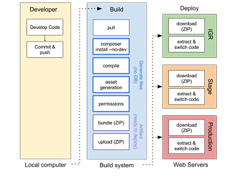
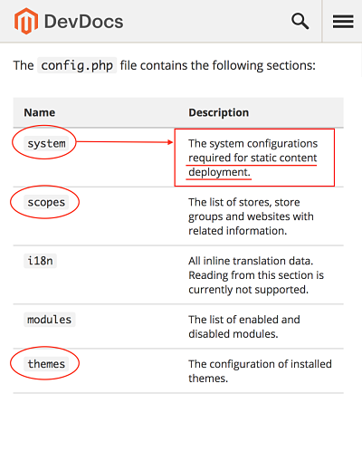

@title[Title]

## Zero Downtime 
## Deployments for Everyone

<span style="font-family:Helvetica Neue; font-weight:bold;">By Juan Alonso - <span style="color:#f46f25;"> @Jalogut</span>

---

<br>

### Desployments == Breaking Live Server 💥

---
@title[Agenda 1]
## Agenda

* **Intro**
* <span style="opacity: 0.2;">Wrong deployment</span>
* <span style="opacity: 0.2;">Right deployment</span>
* <span style="opacity: 0.2;">Zero Downtime</span>
* <span style="opacity: 0.2;">Build Pipeline</span>
* <span style="opactity: 0.2;">M2 Deployer-Plus</span>
* <span style="opacity: 0.2;">CI/CD</span>

@fa[arrow-down]

+++
@title[Scared]
#### Scary moment


+++
@title[M1 Commands]
#### M1 Commands

<br>

- git pull
- [composer install]
- setup:upgrade
- cache:clean

+++
@title[Happy]
#### Happy


---
@title[M2 Deploys]

<br>

### What about M2?

+++?image=assets/img/keep-calm-deploys.png
@title[M2 Commands]

+++
@title[It begins]


+++
@title[Something wrong]
#### Getting crazy


+++
@title[Kill Magento]
#### Want to kill Magento


---
@title[Agenda 2]
## Agenda

* <span style="opacity: 0.2;">Intro</span>
* **Wrong deployment**
* <span style="opacity: 0.2;">Right deployment</span>
* <span style="opacity: 0.2;">Zero Downtime</span>
* <span style="opacity: 0.2;">Build Pipeline</span>
* <span style="opactity: 0.2;">M2 Deployer-Plus</span>
* <span style="opacity: 0.2;">CI/CD</span>

@fa[arrow-down]

+++
#### Manually 👎

<br>

- Waste of time |
- Easy to make mistakes |
- High Downtime: 15min - 30min |

+++
#### Simple Automation not enough 👎

<br>

- Not reliable |
- High Downtime: 15min - 30min |

---
@title[Agenda 3]
## Agenda

* <span style="opacity: 0.2;">Intro</span>
* <span style="opacity: 0.2;">Wrong deployment</span>
* **Right deployment**
* <span style="opacity: 0.2;">Zero Downtime</span>
* <span style="opacity: 0.2;">Build Pipeline</span>
* <span style="opactity: 0.2;">M2 Deployer-Plus</span>
* <span style="opacity: 0.2;">CI/CD</span>

@fa[arrow-down]

+++
@title[Project Setup]
#### Project Setup

<ul>
<li class="fragment">composer.lock in VCS</li>
<li class="fragment">etc/config.php in VCS</li>
<li class="fragment">~~etc/env.php~~ **NOT** in VCS</li>
<li class="fragment">~~vendor~~ **NOT** in VCS</li>
<br>
<li class="fragment">Tutorial: [https://dev.to/jalogut -> Proper Magento 2 Composer Setup](https://dev.to/jalogut/proper-magento-2-composer-setup-40dm)</li>
</ul>


+++
@title[Current live]
#### Current live

<br>


+++
@title[Deploying new version]
#### Deploying new version

<br>


+++
@title[Switch symlink]
#### Switch symlink

<br>


+++
@title[Shared Data]
#### Shared Data


+++
@title[Deployment Tools]

#### Deployment Tools

<br>

- [Deployer (PHP)](https://deployer.org/)
- [Capistrano (Ruby)](http://capistranorb.com/)
- [Shipit-deploy (Node-js)](https://github.com/shipitjs/shipit-deploy)

+++

#### Pros 👍

<br>

- Fully automated |
- Reliable |
- Low Downtime: ~20sec (DB updates) |

---
@title[Disclaimer 2.2]
#### Disclaimer

<br>

##### hereafter <span style="font-family:Helvetica Neue; font-weight:bold">only version <span style="color:#f46f25">>= 2.2</span></span>

---
@title[Agenda 4]
## Agenda

* <span style="opacity: 0.2;">Intro</span>
* <span style="opacity: 0.2;">Wrong deployment</span>
* <span style="opacity: 0.2;">Right deployment</span>
* **Zero Downtime**
* <span style="opacity: 0.2;">Build Pipeline</span>
* <span style="opactity: 0.2;">M2 Deployer-Plus</span>
* <span style="opacity: 0.2;">CI/CD</span>

@fa[arrow-down]

+++
@title[Skip Maintenance]
#### Skip Maintenance


+++
@title[Commands]
#### Commands

<br>

- setup:db:status
- config:import:status (<span style="color:#f46f25">>= 2.2.5</span>)

+++
#### Workaround (config:import:status)

<br>

```bash
bin/magento config:set workaround/check/config_status 1
# Check output == "please run app:config:import"
```

+++
@title[Zero downtime accomplished]

#### Zero Downtime accomplished!


---
@title[Agenda 5]
## Agenda

* <span style="opacity: 0.2;">Intro</span>
* <span style="opacity: 0.2;">Wrong deployment</span>
* <span style="opacity: 0.2;">Right deployment</span>
* <span style="opacity: 0.2;">Zero Downtime</span>
* **Build Pipeline**
* <span style="opacity: 0.2;">CI/CD</span>

@fa[arrow-down]

+++
@title[Build Pipeline]



+++

#### What do we need?

<br>

Config in Build === Config in Servers

+++

#### How?

<br>

Config propagation in files

+++
@title[config.php]



+++

`app:config:dump`


+++

#### Fix in >= 2.3 😩

<br>

- Dump only static: [PR #12410](https://github.com/magento/magento2/pull/12410)

+++

#### Workaround: 

<br>

magento2-config-dump-skip-system.xml: [https://gist.github.com/jalogut/](https://gist.github.com/jalogut/d72e0af6e10c502bff90423e66bf07b9)

+++ 

#### Why?

<br>

- Save CPU during deployment
- Identify files generation issues right away |
- Common bundle to share amongst Servers |
- History for auditing or back in time checks | 

---
@title[Agenda 6]
## Agenda

* <span style="opacity: 0.2;">Intro</span>
* <span style="opacity: 0.2;">Wrong deployment</span>
* <span style="opacity: 0.2;">Right deployment</span>
* <span style="opacity: 0.2;">Zero Downtime</span>
* <span style="opacity: 0.2;">Build Pipeline</span>
* **M2 Deployer-Plus**
* <span style="opactity: 0.2;">CI/CD</span>

+++
@title[Deployer-plus Tool]

#### Out-of-the-box Deployments

<br>

- [jalogut/magento2-deployer-plus](https://github.com/jalogut/magento2-deployer-plus)
- `composer require "jalogut/magento2-deployer-plus"`

+++
@title[Deployer-plus Features]

#### Features

- M2 out of the box deployments
- Compatible with 2.1 and 2.2 |
- Zero Downtime (>= 2.2) |
- Build and Deploy artifacts (>= 2.2) |

---
@title[Agenda 7]
## Agenda

* <span style="opacity: 0.2;">Intro</span>
* <span style="opacity: 0.2;">Wrong deployment</span>
* <span style="opacity: 0.2;">Right deployment</span>
* <span style="opacity: 0.2;">Zero Downtime</span>
* <span style="opacity: 0.2;">Build Pipeline</span>
* <span style="opactity: 0.2;">M2 Deployer-Plus</span>
* **CI/CD**

@fa[arrow-down]

+++

#### Automate

<br>

tests &rarr; builds &rarr; deploys

+++
@title[Jenkins Tutorial]
#### Jenkins tutorial

<br>

Setup Continuos Integration/Delivery system: [https://dev.to/jalogut](https://dev.to/jalogut/setup-continuos-integrationdelivery-system-in-just-4-steps-with-jenkins-pipelines-and-blue-ocean)

+++?gist=jalogut/a7d05c3326bc2dd2206ed269577d3b87&lang=groovy&title=Source: Jenkinsfile

@[13-14,16-17](Branch to Server)
@[22,25](Get code)
@[31](Build)
@[36](Deploy)

+++
@title[Demo CI/CD]
CI/CD


+++
@title[Demo Prod Deploy]
STAGE/PROD Deploy


---

@title[Tips]
## Tips! ✍️

@fa[arrow-down]

+++
#### Flush all caches

<br>

OPcache, Varnish, ...

+++

@title[Composer Tweaks]
#### Speed up Composer

<br>

Better caching
```
composer install --no-dev --prefer-dist --optimize-autoloader
```

Parallel Downloads
```
composer global require hirak/prestissimo
```

+++
#### Update crontab automatically

cron:install --force

```xml
<type name="Magento\Framework\Crontab\TasksProviderInterface">
    <arguments>
        <argument name="tasks" xsi:type="array">
            <item name="CUSTOM_CRON" xsi:type="array">
                <item name="expression" xsi:type="string">0 3 * * *</item>
                <item name="command" xsi:type="string">{magentoRoot}bin/magento custom:command</item>
            </item>
        </argument>
    </arguments>
</type>
```

+++ 
#### Faster Static Files Deployment

<br>

[Compact Strategy](http://devdocs.magento.com/guides/v2.2/config-guide/cli/config-cli-subcommands-static-deploy-strategies.html) (up to 10x faster)
```
setup:static-content:deploy -f --strategy compact
```

**Warning**: I didn't test it yet!

+++

#### DB Backup 

```bash
# deploy.sh
if [[ 1 == ${UPGRADE_NEEDED} ]]; then
  	bin/magento maintenance:enable
  	n98-magerun2 db:dump --compression='gzip' ${WORKING_DIR}/backups/live-$(date +%s).sql.gz
  	bin/magento setup:upgrade --keep-generated
fi
```

---
@title[Issues]
## Issues 🤕

@fa[arrow-down]

+++
#### app:config:dump

<br>

- Avoid dumping everything: [PR #12410](https://github.com/magento/magento2/pull/12410)
- [https://gist.github.com/jalogut/](https://gist.github.com/jalogut/d72e0af6e10c502bff90423e66bf07b9) &rarr; magento2-config-dump-skip-system.xml

+++

#### Share DEV configuration

<br>

- Cumbersome using *$_ENV* variables: [Dev docs](http://devdocs.magento.com/guides/v2.2/config-guide/prod/config-reference-var-name.html)
- Allow configuration by Env: [PR #12361](https://github.com/magento/magento2/pull/12361)

+++
#### Js translations

<br>

- Still not fixed: [#10673](http://devdocs.magento.com/guides/v2.2/config-guide/prod/config-reference-var-name.html)
- `setup:static-content:deploy` once per language

+++
#### Static deploy options ignored

<br>

Doesn't exclude the theme
```
setup:static-content:deploy -f --exclude-theme=Magento/blank
```

---
#### Out-of-the-box Tools

<br>

- [staempfli/magento2-builder-tool](https://github.com/staempfli/magento2-builder-tool)
- [staempfli/magento2-deployment-tool](https://github.com/staempfli/magento2-deployment-tool)

Usage Example: [jalogut/magento-22-mg2-builder](https://github.com/jalogut/magento-22-mg2-builder)

---
@title[Take aways]
## Take Aways

<br>

- Start small: zero downtime possible w/o build system |
- Build pipeline allows new deployment strategies |
- Pipeline issues: create a PR and be patient |

---
@title[Resources]
## Resources

@fa[arrow-down]

+++
#### Magento 2: 

<br>

- Alan Kent - Magento 2.2 deployment:
	- [Video](https://www.youtube.com/watch?v=nIFfn3YHkPs)
	- [Slides](https://info2.magento.com/rs/585-GGD-959/images/The%20New%20Magento%202.2%20Deployment%20Capabilities%20%26%20Patterns.pdf)
- MageDeploy2:
	- [https://dev98.de &rarr; Introducing MageDeploy2](https://dev98.de/2017/03/01/introducing-magedeploy2/)

+++
#### Deployments in General

<br>

[https://serversforhackers.com/](https://serversforhackers.com/) &rarr; [DeployPHP](https://deploy.serversforhackers.com/)

+++
#### This Presentation

- Slides: <span style="font-size:0.6em;">[https://gitpitch.com/jalogut/magento2-deploy-zero-downtime](https://gitpitch.com/jalogut/magento2-deploy-zero-downtime)</span>

- Scripts: <span style="font-size:0.6em;">[https://github.com/jalogut/magento2-deploy-zero-downtime/tree/master/scripts](https://github.com/jalogut/magento2-deploy-zero-downtime/tree/master/scripts)</span>

- Project Example: <span style="font-size:0.6em;">[https://github.com/jalogut/magento-2.2-demo](https://github.com/jalogut/magento-2.2-demo)</span>


---?image=assets/img/about-me.png
@title[About me]

---
@title[thank you]

## Thanks

<br>

Feedback & Questions

👇

[@jalogut](https://twitter.com/jalogut)

 