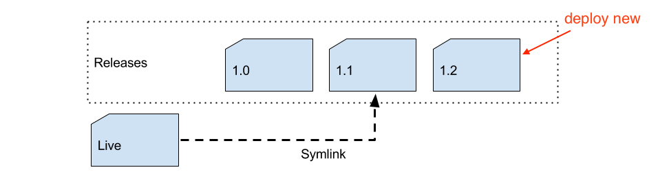

@title[Title]

## Zero Downtime 
## Deployments for Everyone

<span style="font-family:Helvetica Neue; font-weight:bold;color:#f46f25;">Juan Alonso - @Jalogut</span>

---
@title[Deployment definition]
### Deployment == Break Server 💥

---
@title[Agenda 1]
## Agenda

* **Intro**
* <span style="opacity: 0.2;">Right deployment</span>
* <span style="opacity: 0.2;">Zero Downtime (>=2.2)</span>
* <span style="opacity: 0.2;">Build Pipeline (>=2.2)</span>
* <span style="opacity: 0.2;">M2 Deployer Plus</span>
* <span style="opacity: 0.2;">CI/CD</span>

@fa[arrow-down]

+++
@title[M1 Commands]
#### M1 Commands

<br>

- git pull
- [composer install]
- setup:upgrade
- cache:clean

+++
@title[Happy]
#### Easy


+++
@title[M2 Deploys]

### What about M2?

+++?image=assets/img/keep-calm-deploys.png
@title[M2 Commands]

+++
@title[It begins]


+++
@title[Something wrong]
#### Crazy


+++
@title[Kill Magento]
#### Want to kill Magento


+++
#### Manual Deploys 👎

<br>

- Waste of time |
- Easy to make mistakes |
- High Downtime: 15min - 30min |

---
@title[Agenda 2]
## Agenda

* <span style="opacity: 0.2;">Intro</span>
* **Right deployment**
* <span style="opacity: 0.2;">Zero Downtime (>=2.2)</span>
* <span style="opacity: 0.2;">Build Pipeline (>=2.2)</span>
* <span style="opacity: 0.2;">M2 Deployer Plus</span>
* <span style="opacity: 0.2;">CI/CD</span>

@fa[arrow-down]

+++
@title[Preconditions]
#### Preconditions

<br>

<ul>
<li class="fragment">composer.lock in VCS</li>
<li class="fragment">etc/config.php in VCS</li>
<li class="fragment">~~etc/env.php~~ **NOT** in VCS</li>
<li class="fragment">~~vendor~~ **NOT** in VCS</li>
</ul>

+++
@title[Deployment Tools]

#### Use Deployment Tools

<br>

- [Deployer (PHP)](https://deployer.org/)
- [Capistrano (Ruby)](http://capistranorb.com/)
- [Shipit-deploy (Node-js)](https://github.com/shipitjs/shipit-deploy)

+++
@title[Current live]
#### Current live

<br>


+++
@title[Deploying new version]
#### Deploying new version

<br>



+++
@title[Switch symlink]
#### Switch symlink

<br>


+++
@title[Shared Data]
#### Shared Data


+++
@title[Key Commands]
#### Key Commands

```bash
# 1. Files Generation
bin/magento setup:di:compile
bin/magento setup:static-content:deploy [languages1] ... [languagesN]

# 2. Maintenance
bin/magento maintenance:enable

# 3. DB Upgrade
bin/magento setup:upgrade --keep-generated
```

+++
@title[Deployment tools pros]
#### Pros 👍

<br>

- Easy setup |
- Fully automated |
- Reliable |
- Low Downtime: ~20sec (DB updates) |

---
@title[Agenda 3]
## Agenda

* <span style="opacity: 0.2;">Intro</span>
* <span style="opacity: 0.2;">Right deployment</span>
* **Zero Downtime (>=2.2)**
* <span style="opacity: 0.2;">Build Pipeline (>=2.2)</span>
* <span style="opacity: 0.2;">M2 Deployer Plus</span>
* <span style="opacity: 0.2;">CI/CD</span>

@fa[arrow-down]

+++
@title[Skip Maintenance]
#### Skip Maintenance


+++
@title[Commands]
#### Commands

<br>

- setup:db:status
- config:import:status (<span style="color:#f46f25">>= 2.2.5</span>)

+++
#### Workaround
config:import:status

<br>

```bash
bin/magento config:set workaround/check/config_status 1
# Check output == "please run app:config:import"
```

+++
@title[Zero downtime accomplished]

#### Zero Downtime accomplished!


+++
@title[Disclaimer setup_version]
#### Disclaimer

<br>

- setup:db:status checks version in module.xml
- **Do not change it** unless you add new scripts

```xml
<module name="Vendor_Module" setup_version="1.2.0">
```

---
@title[Agenda 4]
## Agenda

* <span style="opacity: 0.2;">Intro</span>
* <span style="opacity: 0.2;">Right deployment</span>
* <span style="opacity: 0.2;">Zero Downtime (>=2.2)</span>
* **Build Pipeline (>=2.2)**
* <span style="opacity: 0.2;">M2 Deployer Plus</span>
* <span style="opacity: 0.2;">CI/CD</span>

@fa[arrow-down]

+++?image=assets/img/build_pipeline_full.png
@title[Build Pipeline]

+++

#### What do we need?

<br>

Config in Build === Config in Servers

+++

#### How?

<br>

Config propagation in files

+++?image=assets/img/config_dump_system_full.png
@title[Docs config.php]

+++

`app:config:dump`


+++

#### Fixed >=2.2.5

<br>

- [PR #12410](https://github.com/magento/magento2/pull/12410)

+++

#### Workaround 

<br>

magento2-config-dump-skip-system.xml: [https://gist.github.com/jalogut/](https://gist.github.com/jalogut/d72e0af6e10c502bff90423e66bf07b9)

+++
@title[Config dump video demo]
Config dump


+++
#### Setup config.php

<br>

```bash
# Dump scopes and themes (>=2.2.5 -> app:config:dump scopes themes)
bin/magento app:config:dump

# Dump system settings for static content
bin/magento config:set --lock-config dev/js/merge_files 1
bin/magento config:set --lock-config dev/js/enable_js_bundling 0
bin/magento config:set --lock-config dev/js/minify_files 1
bin/magento config:set --lock-config dev/css/merge_css_files 0
bin/magento config:set --lock-config dev/css/minify_files 0
bin/magento config:set --lock-config dev/static/sign 1
```

+++ 
@title[config.php example]
#### Example
config.php 

<br>

[jalogut/magento2-project-template-22](https://github.com/jalogut/magento2-project-template-22/blob/master/symlinks/magento/app/etc/config.php) &rarr; symlinks/magento/app/etc/config.php

+++
@title[Build and deploy commands]

Build system
```bash
# Generate files
bin/magento setup:di:compile
bin/magento setup:static-content:deploy -f [languages1] ... [languagesN]
# Create artifact
tar --exclude-from=../artifact.excludes -czf ${ARTIFACT_FILENAME} .
# Transfer artifact
scp -P 22 ${ARTIFACT_FILENAME} ${SERVER_USERNAME}@${SERVER_HOST}:${DOWNLOADS_DIR}
```

Server
```bash
# Extract artifact
tar -xzf ${DOWNLOADS_DIR}/${VERSION}.tar.gz -C ${RELEASE}
# DB Upgrades if needed
bin/magento setup:upgrade --keep-generated
```

+++

#### Why?

<br>

- Save CPU during deployment |
- Common bundle to share amongst Servers |
- History for auditing or back in time checks | 

---
@title[Agenda 5]
## Agenda

* <span style="opacity: 0.2;">Intro</span>
* <span style="opacity: 0.2;">Right deployment</span>
* <span style="opacity: 0.2;">Zero Downtime (>=2.2)</span>
* <span style="opacity: 0.2;">Build Pipeline (>=2.2)</span>
* **M2 Deployer Plus**
* <span style="opacity: 0.2;">CI/CD</span>

@fa[arrow-down]

+++
@title[Deployer-plus Tool]

#### Out-of-the-box Deployments

<br>

```bash
composer require "jalogut/magento2-deployer-plus"
```

+++
@title[Deployer-plus commands]

#### Deployment Commands

<br>

Standard deploys

```bash
bin/dep deploy [<stage>]
```

Build pipeline (>= 2.2)

```bash
bin/dep build
bin/dep deploy-artifact [<stage>]
```

+++
@title[Deployer-plus Features]

#### Features

<br>

- Compatible with 2.1 and 2.2 |
- Zero Downtime (>= 2.2) |
- Build and Deploy artifacts (>= 2.2) |

---
@title[Agenda 6]
## Agenda

* <span style="opacity: 0.2;">Intro</span>
* <span style="opacity: 0.2;">Right deployment</span>
* <span style="opacity: 0.2;">Zero Downtime (>=2.2)</span>
* <span style="opacity: 0.2;">Build Pipeline (>=2.2)</span>
* <span style="opacity: 0.2;">M2 Deployer Plus</span>
* **CI/CD**

@fa[arrow-down]

+++

#### Automate

<br>

tests &rarr; builds &rarr; deploys

+++
@title[Jenkins Tutorial]
#### Jenkins tutorial

<br>

Setup Continuos Integration/Delivery system: [https://dev.to/jalogut](https://dev.to/jalogut/setup-continuos-integrationdelivery-system-in-just-4-steps-with-jenkins-pipelines-and-blue-ocean)

+++
@title[config.php example]
#### Example
Jenkinsfile

<br>

[jalogut/magento2-project-template-22](https://github.com/jalogut/magento2-project-template-22/blob/master/Jenkinsfile) &rarr; Jenkinsfile

+++?gist=jalogut/a7d05c3326bc2dd2206ed269577d3b87&lang=groovy&title=Source: Jenkinsfile

@[9-11,13-14,16-17](Branch to Server)
@[21-22,24-25](Get code)
@[30-31](Build)
@[34,36](Deploy)

+++
@title[Demo CI/CD]
CI/CD


---

@title[Tips]
## Tips! ✍️

@fa[arrow-down]

+++
#### No Interaction >=2.2

<br>

```bash
bin/magento setup:upgrade --keep-generated --no-interaction
bin/magento app:config:import --no-interaction
```

+++
#### Clear all caches

<br>

OPcache, Varnish, ...

```bash
# Add varnish purge in env.php
magento setup:config:set --http-cache hosts=<hostname or ip>:<listen port>
```

+++

@title[Composer Tweaks]
#### Speed up Composer

<br>

Better caching
```
composer install --no-dev --prefer-dist --optimize-autoloader
```

Parallel Downloads
```
composer global require hirak/prestissimo
```

+++
#### Update crontab automatically

cron:install --force

```xml
<type name="Magento\Framework\Crontab\TasksProviderInterface">
    <arguments>
        <argument name="tasks" xsi:type="array">
            <item name="CUSTOM_CRON" xsi:type="array">
                <item name="expression" xsi:type="string">0 3 * * *</item>
                <item name="command" xsi:type="string">{magentoRoot}bin/magento custom:command</item>
            </item>
        </argument>
    </arguments>
</type>
```

---
@title[Issues]
## Issues 🤕

@fa[arrow-down]

+++
#### app:config:dump <=2.2.5

<br>

- Issue: [PR #12410](https://github.com/magento/magento2/pull/12410)
- Workaround: [https://gist.github.com/jalogut/](https://gist.github.com/jalogut/d72e0af6e10c502bff90423e66bf07b9) &rarr; magento2-config-dump-skip-system.xml

+++

#### WYSIWYG & Media Symlink >=2.2.3

<br>

- Issue: [#13929](https://github.com/magento/magento2/issues/13929)
- Workaround: [cweagans/composer-patches](https://github.com/magento/magento2/issues/13929#issuecomment-374865576)

+++

#### Local Config

<br>

- Issue: [PR #12361](https://github.com/magento/magento2/pull/12361)

Workaround

```bash
# Manually set local config settings in env.php
bin/magento config:set --lock-env dev/js/merge_files 0
bin/magento config:set --lock-env dev/js/enable_js_bundling 0
bin/magento config:set --lock-env dev/js/minify_files 0
bin/magento config:set --lock-env dev/css/merge_css_files 0
bin/magento config:set --lock-env dev/css/minify_files 0
```

+++
#### Js translations

<br>

- Issue: [#7862](https://github.com/magento/magento2/issues/7862)

Workaround

```bash
# setup:static-content:deploy once per language
bin/magento setup:static-content:deploy en_US
bin/magento setup:static-content:deploy de_CH
bin/magento setup:static-content:deploy fr_FR
```

---
@title[Take aways]
## Take Aways

<br>

- Start small: zero downtime possible w/o build system |
- Build pipeline allows new deployment strategies |
- Pipeline issues: create a PR and be patient |

+++
@title[Crazy]
#### Before


+++
@title[Everything automated]
#### Now


+++
@title[Kill Magento]
#### Still Sometimes


---
@title[Resources]
## Resources

<br>

- Slides: <span style="font-size:0.7em;">[jalogut/magento2-zero-downtime-deployments-for-everyone](https://gitpitch.com/jalogut/magento2-zero-downtime-deployments-for-everyone/master)</span>

- M2 Deployer Plus: <span style="font-size:0.7em;">[jalogut/magento2-deployer-plus](https://github.com/jalogut/magento2-deployer-plus)</span>

- Project Example: <span style="font-size:0.7em;">[jalogut/magento2-project-template-22](https://github.com/jalogut/magento2-project-template-22)</span>

---?image=assets/img/about-me.png
@title[About me]

---
@title[thank you]

## Thanks

<br>

Feedback & Questions

👇

[@jalogut](https://twitter.com/jalogut)

